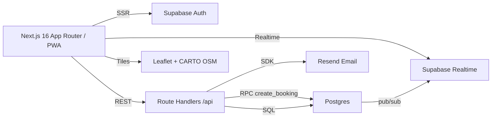

# Samfred Charge

Find a charger. Book your slot. Drive on.

An installable, mobile first PWA for EV drivers and station operators in Nigeria. Built for the PowerTech Nigeria internal engineering hackathon.

## Highlights

- Driver flow: map, search + filters, station detail, slot picker, booking, QR reference, email confirmation, cancellation.
- Operator flow: dashboard with animated counters, station and charger management with pin picker, one tap status toggle, bookings filter.
- Real time updates: charger status changes and new bookings propagate live to open driver sessions using Supabase Realtime.
- Double booking prevention enforced in Postgres via `EXCLUDE USING gist` plus a `SECURITY DEFINER` function; hostile concurrent bookings on the same slot resolve to exactly one confirmed booking.
- Truly dark theme, glossy green primary, glass cards, Motion transitions, respects reduced motion.
- Prices in Naira, dates in Africa/Lagos time.

## Architecture



## Data model

| Table | Purpose |
| --- | --- |
| `profiles` | Mirrors `auth.users`, holds `role` (`driver` or `operator`) |
| `stations` | Owned by an operator, has coordinates and amenities |
| `chargers` | Belong to a station, have status, connector, power, price |
| `availability` | Weekly recurring hours per charger |
| `bookings` | 30 minute `tstzrange` slots, unique 8 char reference, status |

`bookings` carries `exclude using gist (charger_id with =, slot with &&) where (status = 'confirmed')` so overlapping confirmed slots on the same charger cannot exist.

## Double booking prevention

The `create_booking` Postgres function is `SECURITY DEFINER` and does the following inside a single statement:

1. Verifies the charger is online.
2. Verifies the slot is 30 minutes, aligned to `:00` or `:30`, in the future.
3. Verifies the slot is fully inside an availability window (in Africa/Lagos time).
4. Inserts a confirmed booking with a fresh 8 char reference.

If two concurrent transactions attempt the same slot, Postgres raises `exclusion_violation` on the losing one. The function catches that and re-raises the friendly message `This slot was just taken. Please pick another.` The API route maps that to HTTP 409.

## Setup

Prereqs: Node 20+ (Node 22 recommended), a Supabase project, a Resend account (optional for email), `psql` for applying migrations.

1. `cp .env.example .env.local` and fill in the values.
2. `npm install`
3. Apply migrations:
   ```
   psql "$SUPABASE_DB_URL" -f supabase/migrations/0001_init.sql
   psql "$SUPABASE_DB_URL" -f supabase/migrations/0002_rls.sql
   ```
   or `npm run db:push` after exporting `SUPABASE_DB_URL`.
4. Seed:
   ```
   npm run seed
   ```
5. `npm run dev` and open http://localhost:3000

### Demo accounts

- Driver: `driver@demo.samfred.com` / `Demo1234!`
- Operator: `operator@demo.samfred.com` / `Demo1234!`

## Environment variables

| Name | Where |
| --- | --- |
| `NEXT_PUBLIC_SUPABASE_URL` | client + server |
| `NEXT_PUBLIC_SUPABASE_PUBLISHABLE_KEY` | client + server |
| `SUPABASE_SECRET_KEY` | server only (used by `scripts/seed.ts` and never imported by client) |
| `SUPABASE_DB_URL` | migrations |
| `RESEND_API_KEY` | server only (booking email) |
| `EMAIL_FROM` | server |
| `NEXT_PUBLIC_APP_URL` | client + server |

## Tests

```
npm test           # unit + integration (integration skips without live creds)
npm run test:e2e   # Playwright driver + operator flows against a running dev server
```

Unit tests cover slot generation (window respect, past slot rejection, taken slot detection), pricing, references, and formatters. The integration suite exercises `create_booking` for the happy path and drives two concurrent identical bookings to prove exactly one succeeds. E2E tests hit the seeded demo accounts.

## Deploy (Vercel)

1. Import the repo in Vercel.
2. Set the environment variables above in Project Settings > Environment Variables.
3. Deploy. Migrations must be applied to your Supabase project beforehand.

## Roadmap

- Paystack payments for pay per session.
- Live charger telemetry through OCPP so real hardware pushes status without operator taps.
- Push reminders 15 minutes before a slot starts.
- Operator revenue analytics: peak hours heatmap, utilization by connector, month over month trend.
